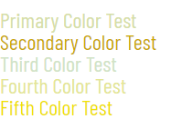

#  SneakerVelcro
Here is a description of our backrooms inspired framework

## Installation 
[Download main.css](css/main.css) to use SneakerVelcro in your project.

### How to use

#### Color
There are 5 colors. To use them, add one of these classes
- `primary.color`
- `secondary.color`
- `third.color`
- `fourth.color`
- `fifth.color`

Here is an example of the color options

You can use these colors as backgrounds too by adding the following classes
- `bg-primary`
- `bg-secondary`
- `bg-third`
- `bg-fourth`
- `bg-fifth`

#### Borders
There are 2 color options for borders with 2 size options
For a regular border or small border with the primary color
- `primary-border`
- `primary-border-small`

For regular border or small border with the secondary color
- `secondary-border`
- `secondary-border-small`

#### HTML Elements
There a specific HTML elements you can give that backrooms feel to

Buttons
- To use a backrooms button, use class
- `.btn`

Tables
- To insert a spooky backrooms table
- `.custom-table`
- `.custom-table td`

Lists
- HTML element list class is
- `.list-group`

Forms
- To gather spooky responses from the dwelling spectors, use class
- `.form-group` 
- `.form-group label` 
- `.form-group select` 
 
### Customization 
For spacing customization. You have plenty of specific sizes to increase to make your website really feel like you are in the backrooms.

You can increase both margin and padding on all sides at once, or decide to increase a single side such as just the top.
There are 6 sizes in total including an option for zero padding. 

For Margin all, please do your very best to use
- `.m-0`
- `.m-sm`
- `.m-md`
- `.m-lg`
- `.m-xl`
- `.m-xxl`

For margin top add a "t" after the m
- `.mt-0`

For margin bottom add a "b"
- `.mb-0`

For margin left add an "l"
- `.ml-0`

for margin right add an "r"
- `.mr-0`

The same rules apply to padding. Except use a "p" instead of an m.